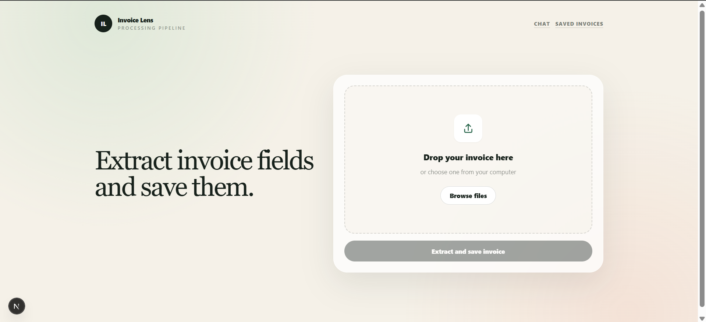
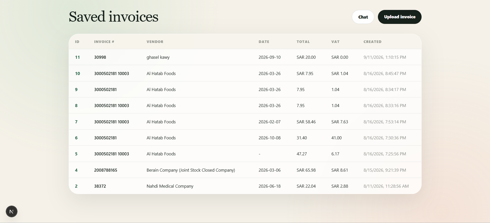
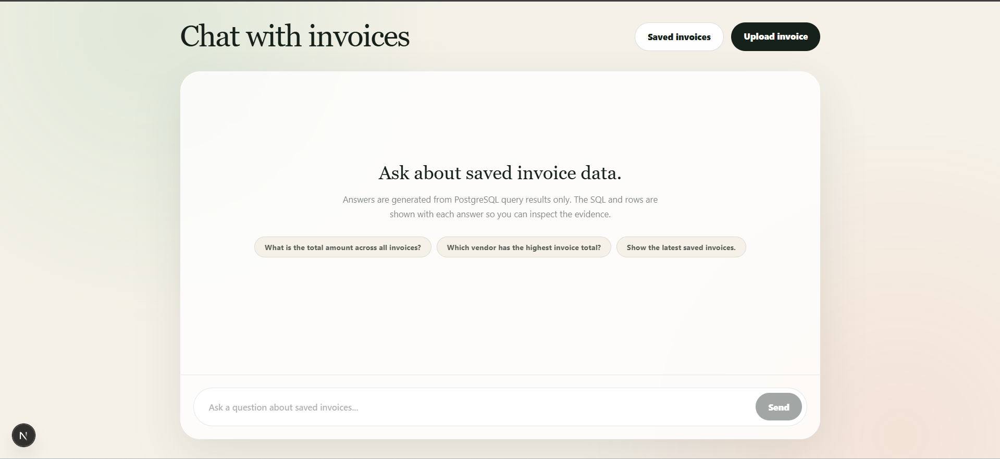

# Invoice Lens 🔍

## Overview

Invoice Lens is an AI-powered invoice processing application designed to automate the extraction, storage, management, and querying of invoice data.

Users can upload invoices in PDF or image format, and the application automatically extracts their content using Tesseract OCR. The extracted text is then processed using the OpenAI API to identify and convert important invoice information into structured data.

The extracted information—including invoice number, vendor name, date, total amount, VAT, and currency—is stored in a PostgreSQL database. Users can review and edit saved invoice records through the web interface.

Invoice Lens also includes an AI-powered chat interface, allowing users to ask natural-language questions about their stored invoices and receive answers based on the data available in the database.

## How It Works

When a user uploads an invoice, Tesseract OCR extracts the raw text from the PDF or image. The extracted text is then sent to the OpenAI API, which analyzes the invoice and converts the unstructured text into structured invoice fields.

The structured information is stored in PostgreSQL, where it can be retrieved, reviewed, and edited later.

The application also allows users to interact with their saved invoice data through a chat interface. Users can ask questions such as:

- “What is the total amount across all invoices?”
- “Show me invoices from a specific vendor.”
- “How much VAT was paid?”
- “What is the total amount of a specific invoice?”

For supported questions, the backend generates safe, read-only database queries, retrieves the relevant invoice records, and uses the results to produce a natural-language answer.

## Key Features

- Invoice Upload — Upload invoices in PDF or image format.
- OCR Processing — Extract raw invoice text using Tesseract OCR.
- AI-Powered Extraction — Use the OpenAI API to convert unstructured invoice text into structured data.
- Structured Invoice Fields — Extract invoice number, vendor name, date, total amount, VAT, and currency.
- Database Storage — Store extracted invoice information in PostgreSQL.
- Invoice Management — View and edit saved invoice records.
- AI Invoice Chat — Ask natural-language questions about stored invoice data.
- Safe Database Queries — Restrict AI-generated SQL to safe, read-only operations.
- Web Interface — Upload, review, manage, and query invoices through a modern frontend.

## Tech Stack

| Component            | Technology          |
| -------------------- | ------------------- |
| Frontend             | Next.js, TypeScript |
| Backend              | FastAPI, Python     |
| API Server           | Uvicorn             |
| OCR                  | Tesseract OCR       |
| AI                   | OpenAI API          |
| Database             | PostgreSQL          |
| Database Environment | Docker              |

## Images for The Project

### Upload Page

### Saved Invoices Page

### Chat with invoices

